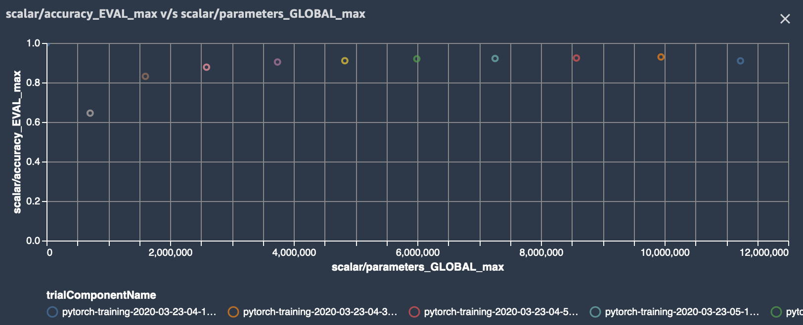
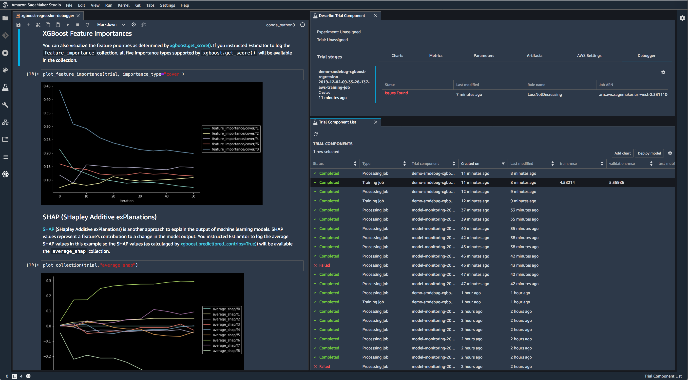
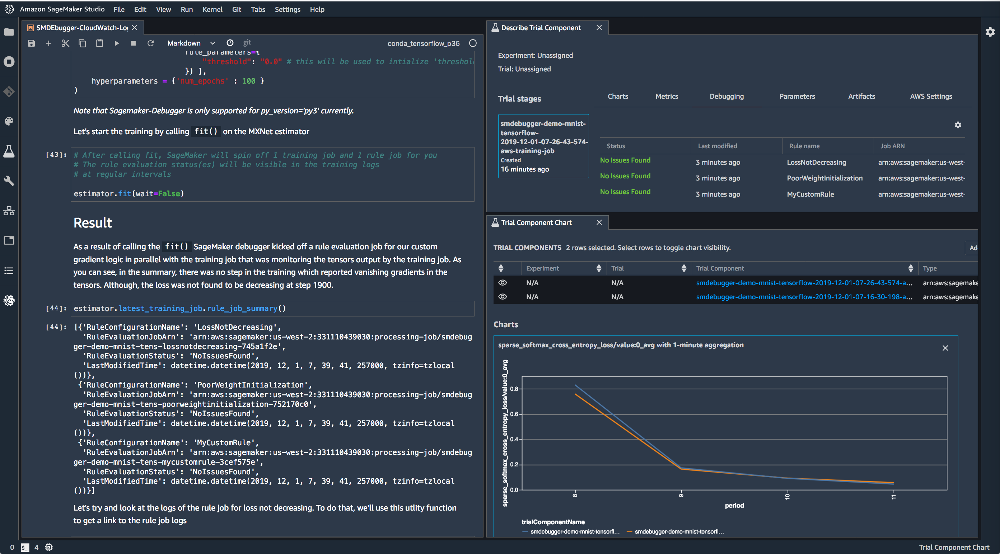

SMDebug: Amazon SageMaker Debugger Client Library
=================================================

Table of Contents
-----------------

-  `Overview <#overview>`__
-  `Install the smdebug library <#install-the-smdebug-library>`__
-  `Debugger-supported Frameworks <#debugger-supported-frameworks>`__
-  `How It Works <#how-it-works>`__
-  `Examples <#examples>`__
-  `SageMaker Debugger in action <#sagemaker-debugger-in-action>`__
-  `Further Documentation and
   References <#further-documentation-and-references>`__

Overview
--------

`Amazon SageMaker
Debugger <https://docs.aws.amazon.com/sagemaker/latest/dg/train-debugger.html>`__
automates the debugging and profiling process of machine learning training.
SageMaker Debugger provides built-in features to capture output tensors,
monitor system utilization, and profile ML frameworks from training jobs of your own training script
and Docker containers.

You have flexibility to build customized *hooks*
for saving training data to a storage either locally or in a cloud storage such as `Amazon
S3 <https://aws.amazon.com/s3/?nc=sn&loc=0>`__. You can also use Debugger *rules* - built-in or custom -
to analyze the saved data, identify training issues, receive alerts,
and take actions to stop training.

The ``smdebug`` client library is an open source library that powers SageMaker Debugger
by calling the saved training data from training jobs. ``smdebug`` retrieves and
filters the tensors generated from Debugger such as gradients, weights,
and biases.

SageMaker Debugger helps you develop and optimize model performance and computation. It also allows to run
training jobs minimally modifying estimators,
tracing training data (output tensors, system metrics, and framework metrics),
catching anomalies while training models, and iteratively pruning large models.

Debugger supports TensorFlow, PyTorch, MXNet, and XGBoost frameworks.

The following list is a summary of the main functionalities of Debugger:

-  Run, debug, and profile training jobs of your model on SageMaker when using
   `AWS managed containers <#debugger-supported-frameworks>`__
-  No changes needed to your training script if using AWS Deep Learning
   Containers with Debugger fully integrated
-  Minimal changes to your training script if using AWS containers with
   script mode or custom containers
-  Full visibility into any tensor retrieved from targeted parts of the
   training jobs
-  Real-time training job monitoring through Rules
-  Automated anomaly detection and state assertions through built-in and
   custom Rules on SageMaker
-  Actions on your training jobs based on the status of Rules
-  Interactive exploration of saved tensors
-  Distributed training support
-  TensorBoard support

See `How it works <#how-it-works>`__ for more details.

--------------

Install the smdebug library
---------------------------

The ``smdebug`` library runs on Python 3. Install using the following
command:

.. code:: python

   pip install smdebug

--------------

Debugger-supported Frameworks
-----------------------------

For a complete overview of Amazon SageMaker Debugger to learn how it
works, go to the `Use Debugger in AWS
Containers <https://docs.aws.amazon.com/sagemaker/latest/dg/debugger-container.html>`__
developer guide.

AWS Deep Learning Containers with zero code change
~~~~~~~~~~~~~~~~~~~~~~~~~~~~~~~~~~~~~~~~~~~~~~~~~~

Debugger is installed by default in AWS Deep Learning Containers with
TensorFlow, PyTorch, MXNet, and XGBoost. The following framework
containers enable you to use Debugger with no changes to your training
script, by automatically adding `SageMaker Debugger’s
Hook <api.md#glossary>`__.

The following frameworks are available AWS Deep Learning Containers with
the deep learning frameworks for the zero script change experience.

+--------------------------------+------------------------------------+
| Framework                      | Version                            |
+================================+====================================+
| `TensorFlow <tensorflow.md>`__ | 1.15, 2.1.0, 2.2.0, 2.3.0, 2.3.1   |
+--------------------------------+------------------------------------+
| `MXNet <mxnet.md>`__           | 1.6, 1.7                           |
+--------------------------------+------------------------------------+
| `PyTorch <pytorch.md>`__       | 1.4, 1.5, 1.6                      |
+--------------------------------+------------------------------------+
| `XGBoost <xgboost.md>`__       | 0.90-2, 1.0-1 (`As a built-in      |
|                                | algorithm <docs/xgboost.md#use-xg  |
|                                | boost-as-a-built-in-algorithm>`__) |
+--------------------------------+------------------------------------+

**Note**: Debugger with zero script change is partially available for
TensorFlow v2.1.0. The ``inputs``, ``outputs``, ``gradients``, and
``layers`` built-in collections are currently not available for these
TensorFlow versions.

AWS training containers with script mode
~~~~~~~~~~~~~~~~~~~~~~~~~~~~~~~~~~~~~~~~

The ``smdebug`` library supports frameworks other than the ones listed
above while using AWS containers with script mode. If you want to use
SageMaker Debugger with one of the following framework versions, you
need to make minimal changes to your training script.

+---------------------------------+-----------------------------------+
| Framework                       | Versions                          |
+=================================+===================================+
| `TensorFlow <tensorflow.md>`__  | 1.13, 1.14, 1.15, 2.1.0, 2.2.0,   |
|                                 | 2.3.0, 2.3.1                      |
+---------------------------------+-----------------------------------+
| Keras (with TensorFlow backend) | 2.3                               |
+---------------------------------+-----------------------------------+
| `MXNet <mxnet.md>`__            | 1.4, 1.5, 1.6, 1.7                |
+---------------------------------+-----------------------------------+
| `PyTorch <pytorch.md>`__        | 1.2, 1.3, 1.4, 1.5, 1.6           |
+---------------------------------+-----------------------------------+
| `XGBoost <xgboost.md>`__        | 0.90-2, 1.0-1 (As a framework)    |
+---------------------------------+-----------------------------------+

Debugger on custom containers or local machines
~~~~~~~~~~~~~~~~~~~~~~~~~~~~~~~~~~~~~~~~~~~~~~~

You can also fully use the Debugger features in custom containers with
the SageMaker Python SDK. Furthermore, ``smdebug`` is an open source
library, so you can install it on your local machine for any advanced
use cases that cannot be run in the SageMaker environment and for
constructing ``smdebug`` custom hooks and rules.

--------------

How It Works
------------

Amazon SageMaker Debugger uses the construct of a ``Hook`` to save the
values of requested tensors throughout the training process. You can
then setup a ``Rule`` job which simultaneously monitors and validates
these tensors to ensure that training is progressing as expected.

A ``Rule`` checks for vanishing gradients, exploding tensor values, or
poor weight initialization. Rules are attached to Amazon CloudWatch
events, so that when a rule is triggered it changes the state of the
CloudWatch event. You can configure any action on the CloudWatch event,
such as to stop the training job saving you time and money.

Debugger can be used inside or outside of SageMaker. However the
built-in rules that AWS provides are only available for SageMaker
training. Scenarios of usage can be classified into the following three
cases.

Using SageMaker Debugger on AWS Deep Learning Containers with zero training script change
~~~~~~~~~~~~~~~~~~~~~~~~~~~~~~~~~~~~~~~~~~~~~~~~~~~~~~~~~~~~~~~~~~~~~~~~~~~~~~~~~~~~~~~~~

Use Debugger built-in hook configurations and rules while setting up the
estimator and monitor your training job.

For a full guide and examples of using the built-in rules, see `Running
a Rule with zero script change on AWS Deep Learning
Containers <https://docs.aws.amazon.com/sagemaker/latest/dg/use-debugger-built-in-rules.html>`__.

To see a complete list of built-in rules and their functionalities, see
`List of Debugger Built-in
Rules <https://docs.aws.amazon.com/sagemaker/latest/dg/debugger-built-in-rules.html>`__.

Using SageMaker Debugger on AWS training containers with script mode
~~~~~~~~~~~~~~~~~~~~~~~~~~~~~~~~~~~~~~~~~~~~~~~~~~~~~~~~~~~~~~~~~~~~

You can use Debugger with your training script on your own container
making only a minimal modification to your training script to add
Debugger’s ``Hook``. For an example template of code to use Debugger on
your own container in TensorFlow 2.x frameworks, see `Run Debugger in
custom container <#Run-Debugger-in-custom-container>`__. See the
following instruction pages to set up Debugger in your preferred
framework. - `TensorFlow <tensorflow.rst>`__ - `MXNet <mxnet.rst>`__ -
`PyTorch <pytorch.rst>`__ - `XGBoost <xgboost.rst>`__

Using SageMaker Debugger on custom containers
~~~~~~~~~~~~~~~~~~~~~~~~~~~~~~~~~~~~~~~~~~~~~

Debugger is available for any deep learning models that you bring to
Amazon SageMaker. The AWS CLI, the SageMaker Estimator API, and the
Debugger APIs enable you to use any Docker base images to build and
customize containers to train and debug your models. To use Debugger
with customized containers, go to `Use Debugger in Custom Training
Containers <https://docs.aws.amazon.com/sagemaker/latest/dg/debugger-bring-your-own-container.html>`__.

Using SageMaker Debugger on a non-SageMaker environment
~~~~~~~~~~~~~~~~~~~~~~~~~~~~~~~~~~~~~~~~~~~~~~~~~~~~~~~

Using the smdebug library, you can create custom hooks and rules (or
manually analyze the tensors) and modify your training script to enable
tensor analysis on a non-SageMaker environment, such as your local
machine. For an example of this, see `Run Debugger
locally <#run-debugger-locally>`__.

--------------

Examples
--------

SageMaker Notebook Examples
~~~~~~~~~~~~~~~~~~~~~~~~~~~

To find a collection of demonstrations using Debugger, see `SageMaker
Debugger Example
Notebooks <https://github.com/awslabs/amazon-sagemaker-examples/tree/master/sagemaker-debugger>`__.

Run Debugger rules with zero script change
^^^^^^^^^^^^^^^^^^^^^^^^^^^^^^^^^^^^^^^^^^

This example shows a how to use Debugger with Zero Script Change of your
training script on a SageMaker DLC.

.. code:: python

   import sagemaker as sm
   from sagemaker.debugger import rule_configs, Rule, CollectionConfig

   # Choose a built-in rule to monitor your training job
   rule = Rule.sagemaker(
       rule_configs.exploding_tensor(),
       # configure your rule if applicable
       rule_parameters={"tensor_regex": ".*"},
       # specify collections to save for processing your rule
       collections_to_save=[
           CollectionConfig(name="weights"),
           CollectionConfig(name="losses"),
       ],
   )

   # Pass the rule to the estimator
   sagemaker_simple_estimator = sm.tensorflow.TensorFlow(
       entry_point="script.py", #replace script.py to your own training script
       role=sm.get_execution_role(),
       framework_version="1.15",
       py_version="py3",
       # argument for smdebug below
       rules=[rule],
   )

   sagemaker_simple_estimator.fit()
   tensors_path = sagemaker_simple_estimator.latest_job_debugger_artifacts_path()

   import smdebug.trials as smd
   trial = smd.create_trial(out_dir=tensors_path)
   print(f"Saved these tensors: {trial.tensor_names()}")
   print(f"Loss values during evaluation were {trial.tensor('CrossEntropyLoss:0').values(mode=smd.modes.EVAL)}")

That’s it! When you configure the ``sagemaker_simple_estimator``, you
simply specify the ``entry_point`` to your training script python file.
When you run the ``sagemaker_simple_estimator.fit()`` API, SageMaker
will automatically monitor your training job for you with the Rules
specified and create a ``CloudWatch`` event that tracks the status of
the Rule, so you can take any action based on them.

If you want additional configuration and control, see `Running SageMaker
jobs with Debugger <sagemaker>`__ for more information.

Run Debugger in custom container
^^^^^^^^^^^^^^^^^^^^^^^^^^^^^^^^

The following example shows how to set ``hook`` to set a training model
using Debugger in your own container. This example is for containers in
TensorFlow 2.x framework using GradientTape to configure the ``hook``.

.. code:: python

   import smdebug.tensorflow as smd
   hook = smd.KerasHook(out_dir=args.out_dir)

   model = tf.keras.models.Sequential([ ... ])
       for epoch in range(n_epochs):
           for data, labels in dataset:
               dataset_labels = labels
               # wrap the tape to capture tensors
               with hook.wrap_tape(tf.GradientTape(persistent=True)) as tape:
                   logits = model(data, training=True)  # (32,10)
                   loss_value = cce(labels, logits)
               grads = tape.gradient(loss_value, model.variables)
               opt.apply_gradients(zip(grads, model.variables))
               acc = train_acc_metric(dataset_labels, logits)
               # manually save metric values
               hook.record_tensor_value(tensor_name="accuracy", tensor_value=acc)

To see a full script of this, refer to the
`tf_keras_gradienttape.py <https://github.com/awslabs/sagemaker-debugger/blob/master/examples/tensorflow2/scripts/tf_keras_gradienttape.py>`__
example script. For a notebook example of using BYOC in PyTorch, see
`Using Amazon SageMaker Debugger with Your Own PyTorch
Container <https://github.com/awslabs/amazon-sagemaker-examples/blob/master/sagemaker-debugger/pytorch_custom_container/pytorch_byoc_smdebug.ipynb>`__

Run Debugger locally
^^^^^^^^^^^^^^^^^^^^

This example shows how to use Debugger for the Keras ``model.fit()``
API.

To use Debugger, simply add a callback ``hook``:

.. code:: python

   import smdebug.tensorflow as smd
   hook = smd.KerasHook(out_dir='~/smd_outputs/')

   model = tf.keras.models.Sequential([ ... ])
   model.compile(
       optimizer='adam',
       loss='sparse_categorical_crossentropy',
   )

   # Add the hook as a callback
   model.fit(x_train, y_train, epochs=2, callbacks=[hook])
   model.evaluate(x_test, y_test, callbacks=[hook])

   # Create a trial to inspect the saved tensors
   trial = smd.create_trial(out_dir='~/smd_outputs/')
   print(f"Saved these tensors: {trial.tensor_names()}")
   print(f"Loss values during evaluation were {trial.tensor('CrossEntropyLoss:0').values(mode=smd.modes.EVAL)}")

--------------

SageMaker Debugger in Action
----------------------------

-  Through the model pruning process using Debugger and ``smdebug``, you
   can iteratively identify the importance of weights and cut neurons
   below a threshold you define. This process allows you to train the
   model with significantly fewer neurons, which means a lighter, more
   efficient, faster, and cheaper model without compromising accuracy.
   The following accuracy versus the number of parameters graph is
   produced in Studio. It shows that the model accuracy started from
   about 0.9 with 12 million parameters (the data point moves from right
   to left along with the pruning process), improved during the first
   few pruning iterations, kept the quality of accuracy until it cut the
   number of parameters down to 6 million, and start sacrificing the
   accuracy afterwards.

  |Debugger Iterative Model Pruning using ResNet| Debugger provides you
  tools to access such training process and have a complete control over
  your model. See `Using SageMaker Debugger and SageMaker Experiments for
  iterative model
  pruning <https://github.com/awslabs/amazon-sagemaker-examples/blob/master/sagemaker-debugger/pytorch_iterative_model_pruning/iterative_model_pruning_resnet.ipynb>`__
  notebook for the full example and more information.

-  Use Debugger with XGBoost in SageMaker Studio to save feature
   importance values and plot them in a notebook during training.
   |Debugger XGBoost Visualization Example|

-  Use Debugger with TensorFlow in SageMaker Studio to run built-in
   rules and visualize the loss. |Debugger TensorFlow Visualization
   Example|

--------------

Further Documentation and References
------------------------------------

+-----------------------------------+-----------------------------------+
| Section                           | Description                       |
+===================================+===================================+
| :doc:`sagemaker`                  | SageMaker users, we recommend you |
|                                   | start with this page on how to    |
|                                   | run SageMaker training jobs with  |
|                                   | SageMaker Debugger.               |
+-----------------------------------+-----------------------------------+
| Frameworks                        | See the frameworks pages for      |
|   - :doc:`tensorflow`             | details on what’s supported and   |
|   - :doc:`pytorch`                | how to modify your training       |
|   - :doc:`mxnet`                  | script if applicable.             |
|   - :doc:`xgboost`                |                                   |
+-----------------------------------+-----------------------------------+
| :doc:`api`                        | Full description of our APIs      |
|                                   | on saving tensors.                |
+-----------------------------------+-----------------------------------+
| :doc:`analysis`                   | For description of the programming|
|                                   | model provided by the APIs that   |
|                                   | enable you to perform interactive |
|                                   | exploration of tensors saved,     |
|                                   | as well as to write your own      |
|                                   | rules monitoring your training    |
|                                   | jobs.                             |
+-----------------------------------+-----------------------------------+

License
-------

This library is licensed under the Apache 2.0 License.

.. |codecov| image:: https://codecov.io/gh/awslabs/sagemaker-debugger/branch/master/graph/badge.svg
   :target: https://codecov.io/gh/awslabs/sagemaker-debugger
.. |PyPI| image:: https://badge.fury.io/py/smdebug.svg
   :target: https://badge.fury.io/py/smdebug

